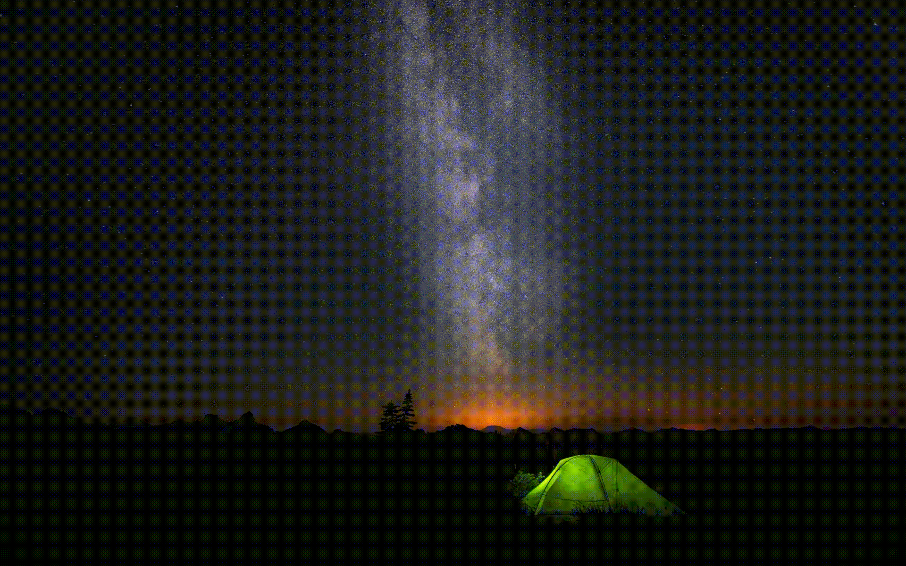

# Example script:
  ```python
from tools import AnimTools

def main():
    
    #initialization and setup
    settings = {
        "light": ["1","2","3","4","5"],
        "left_star": ["0", "1","2","3","4","5"],
        "right_star"  : ["0", "1","2","3","4","5"]
    }

    at = AnimTools(settings).init_with_first()

    #define sequences
    at.sequence("Tent pulse").pulse('light', 300)
    at.sequence("Left shooting star").full_transition("left_star", 100).set("left_star", "0")
    at.sequence("Right shooting star").full_transition("right_star", 100).set("right_star", "0")

    #Run Animation
    at.sequence("Tent pulse").loop_background()

    wait(1500)

    at.sequence("Left shooting star").once()

    wait(1500)

    at.sequence("Right shooting star").once()

    wait(1000)
``` 
### Example command
> python3 AutoAnim.py -p example/tent.psd -s example/tent.py

### Example output (converted to gif for online viewing, actual results are in source quality)

